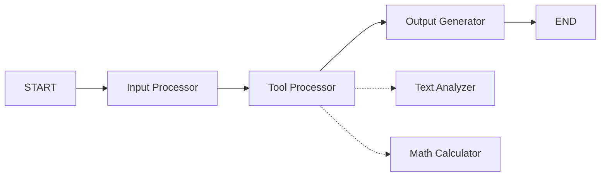
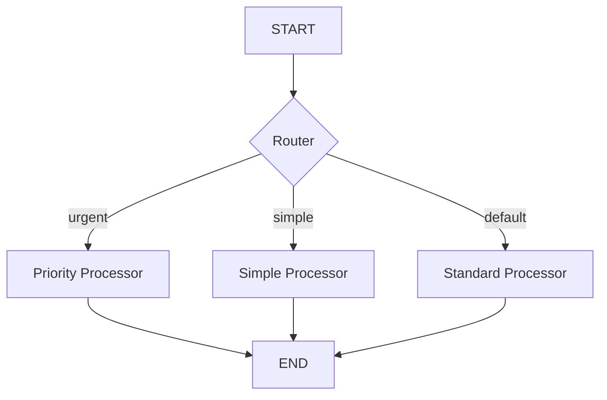

# LangGraph Sample Project 🚀

[](https://www.python.org/downloads/)
[](https://opensource.org/licenses/MIT)
[](https://github.com/psf/black)

A production-ready LangGraph application featuring 3 sample nodes with LangGraph Studio integration for debugging and visualization. Built with industry-standard architecture and best practices.

## 📋 Project Overview

This project demonstrates professional LangGraph workflow development with:

- **✨ 3 Sample Nodes**: Input Processor, Data Transformer, and Output Generator
- **� Tool Integration**: Text Analyzer and Math Calculator tools
- **�🔀 Advanced Routing**: Conditional logic and multiple processor types
- **🎨 LangGraph Studio**: Visual debugging and workflow monitoring
- **🧪 Full Test Suite**: Unit and integration tests with pytest
- **📚 Comprehensive Docs**: Architecture, API, and deployment guides
- **🏗️ Industry Structure**: Professional folder organization

## 🏗️ Project Structure

```
langgraph-AI/
├── src/                          # Source code package
│   ├── config.py                # Configuration management
│   ├── models/                  # Data models (GraphState)
│   ├── nodes/                   # Node implementations
│   │   ├── input_processor.py  # Input processing node
│   │   ├── data_transformer.py # LLM transformation node
│   │   ├── output_generator.py # Output formatting node
│   │   └── tool_processor.py   # Tool integration node
│   ├── tools/                   # Reusable tools
│   │   ├── text_analyzer.py    # Text analysis tool
│   │   ├── math_calculator.py  # Math calculation tool
│   │   └── README.md           # Tool documentation
│   └── workflows/               # Workflow definitions
│       ├── basic_workflow.py   # 3-node sequential workflow
│       └── advanced_workflow.py # Conditional routing
├── tests/                       # Test suite
│   ├── test_nodes.py           # Node unit tests
│   ├── test_tools.py           # Tool unit tests
│   ├── test_integration.py     # Tool integration tests
│   └── test_workflows.py       # Integration tests
├── docs/                        # Documentation
│   ├── DIAGRAMS.md             # Mermaid diagrams
│   └── STRUCTURE.md            # Architecture guide
├── notebooks/                   # Jupyter notebooks
│   └── test_workflow.ipynb     # Interactive testing
├── run_basic.py                 # Entry point for basic workflow
├── run_advanced.py              # Entry point for advanced workflow
├── main.py                      # Main workflow with tool integration
├── test_tools.py                # Tool testing script
├── langgraph.json               # LangGraph Studio config
├── requirements.txt             # Production dependencies
├── requirements-dev.txt         # Development dependencies
└── pyproject.toml              # Modern Python project config
```

**📖 See [docs/STRUCTURE.md](docs/STRUCTURE.md) for detailed architecture explanation**

## 🚀 Quick Start

### 1. Clone and Setup

```bash
# Clone the repository
git clone <your-repo-url>
cd langgraph-AI

# Create virtual environment
python -m venv .venv
source .venv/bin/activate  # On Windows: .venv\Scripts\activate

# Install dependencies
pip install -r requirements.txt

# For development
pip install -r requirements-dev.txt
```

### 2. Configure Environment

```bash
# Copy environment template
cp .env.example .env

# Edit .env with your API keys
OPENAI_API_KEY=your_openai_api_key_here
LANGCHAIN_API_KEY=your_langsmith_api_key_here
```

### 3. Run Workflows

#### Basic Workflow (3 Sequential Nodes)
```bash
python run_basic.py
```

#### Advanced Workflow (Conditional Routing)
```bash
python run_advanced.py
```

#### Using as Package
```python
from src.workflows import run_workflow, create_advanced_workflow

# Run basic workflow
result = run_workflow("Hello, LangGraph!")

# Use advanced workflow
app = create_advanced_workflow()
result = app.invoke({"input_text": "urgent message", "step": "started"})
```

#### Tool-Enhanced Workflows
```python
from main import run_workflow, run_with_tools

# Run with tools enabled
result = run_workflow("Analyze this text", use_tools=True)

# Or use convenience function
result = run_with_tools("Calculate: 2 + 3 * 4")
```

## 🔧 Tools Integration

This project includes a comprehensive tools system that enhances LangGraph workflows with reusable functionality.

### Available Tools

#### 📊 Text Analyzer Tool
Provides comprehensive text analysis capabilities:

```python
from src.tools.text_analyzer import text_analyzer_tool

result = text_analyzer_tool("Your text here")
print(f"Words: {result['word_count']}")
print(f"Reading time: {result['reading_time_minutes']} minutes")
```

**Features:**
- **Word & Character Counting**: Total words, characters (with/without spaces)
- **Structure Analysis**: Sentence and paragraph counting
- **Reading Metrics**: Estimated reading time (200 words/minute)
- **Word Statistics**: Average word length, longest word, unique words
- **Summary Generation**: Comprehensive text summary

**Output Example:**
```json
{
  "word_count": 14,
  "character_count": 79,
  "sentence_count": 2,
  "reading_time_minutes": 0.1,
  "average_word_length": 5.64,
  "longest_word": "comprehensive",
  "unique_word_count": 12,
  "summary": "Text contains 14 words, 2 sentences, and takes ~0.1 minutes to read."
}
```

#### 🔢 Math Calculator Tool
Safely evaluates mathematical expressions:

```python
from src.tools.math_calculator import math_calculator_tool

result = math_calculator_tool("2 + 3 * 4")
if result.get("success"):
    print(f"Result: {result['result']}")  # Output: 14
```

**Features:**
- **Basic Operations**: +, -, *, /, ** (power)
- **Mathematical Functions**: sqrt, sin, cos, tan, log, log10
- **Constants**: pi, e
- **Utility Functions**: abs, round, min, max, sum, ceil, floor
- **Safe Evaluation**: No arbitrary code execution
- **Error Handling**: Comprehensive error reporting

**Supported Expressions:**
```python
"2 + 3 * 4"           # → 14
"sqrt(16) + 5"        # → 9.0  
"sin(pi/2)"           # → 1.0
"max(1, 5, 3)"        # → 5
"round(3.14159, 2)"   # → 3.14
```

### Tool Integration Patterns

#### 1. Direct Tool Usage
```python
from src.tools import text_analyzer_tool, math_calculator_tool

# Analyze text
analysis = text_analyzer_tool("Sample text for analysis")

# Perform calculations  
calc = math_calculator_tool("10 / 2 + 3")
```

#### 2. Tool Processor Node
Pre-built node that demonstrates tool integration:

```python
from src.nodes.tool_processor import tool_processor_node

# Add to workflow
workflow.add_node("tool_processor", tool_processor_node)
workflow.add_edge("input_processor", "tool_processor")
```

#### 3. Custom Tool Integration
```python
def my_enhanced_node(state: GraphState) -> GraphState:
    text = state.get("processed_text", "")
    
    # Use text analyzer
    analysis = text_analyzer_tool(text)
    
    # Conditional tool usage
    if any(char.isdigit() for char in text):
        calc_result = math_calculator_tool("extracted_expression")
        enhanced_text = f"{text}\n\nCalculation: {calc_result}"
    else:
        enhanced_text = f"{text}\n\nAnalysis: {analysis['summary']}"
    
    return {**state, "transformed_text": enhanced_text}
```

### Tool Testing

```bash
# Test individual tools
python -m tests.test_tools

# Test tool integration  
python -m tests.test_integration

# Quick tool demo
python test_tools.py
```

### Creating Custom Tools

Follow this template to create new tools:

```python
def my_custom_tool(input_data: str) -> dict:
    """
    Description of what your tool does.
    
    Args:
        input_data: Description of input parameter
        
    Returns:
        Dictionary with results and metadata
    """
    try:
        # Tool logic here
        result = process_input(input_data)
        
        return {
            "success": True,
            "result": result,
            "metadata": {"tool": "my_custom_tool"}
        }
    except Exception as e:
        return {
            "success": False,
            "error": str(e),
            "result": None
        }
```

**Best Practices:**
- Include comprehensive error handling
- Use consistent return formats
- Add proper type hints and docstrings
- Validate inputs for security
- Include test cases and examples

## 🎨 LangGraph Studio

Start the development server for visual debugging:

```bash
langgraph dev
```

Access:
- **🎨 Studio UI**: https://smith.langchain.com/studio/?baseUrl=http://127.0.0.1:2024
- **🚀 API**: http://127.0.0.1:2024
- **📚 Docs**: http://127.0.0.1:2024/docs

## 🧩 Workflow Components

### Basic Workflow


**Nodes:**
1. **Input Processor**: Cleans and formats input text
2. **Data Transformer**: Applies LLM enhancement (with fallback)
3. **Output Generator**: Creates final formatted output

### Tool-Enhanced Workflow



**Enhanced Features:**
1. **Input Processor**: Standard text preprocessing
2. **Tool Processor**: Integrates text analysis and mathematical calculations
3. **Output Generator**: Creates enriched output with analysis results

**Tool Processing Includes:**
- Comprehensive text metrics (word count, reading time, etc.)
- Mathematical expression evaluation
- Average characters per word calculation
- Reading efficiency assessment

### Advanced Workflow



**Features:**
- Conditional routing based on input content
- Multiple processing strategies
- Demonstrates branching patterns

## 🧪 Testing

### Run Tests

```bash
# Run all tests
pytest

# Run with coverage
pytest --cov=src --cov-report=html

# Run specific test categories
pytest tests/test_nodes.py -v          # Node tests
pytest tests/test_tools.py -v          # Tool tests  
pytest tests/test_integration.py -v    # Integration tests

# Test tools directly
python -m tests.test_tools              # Individual tool testing
python -m tests.test_integration        # Tool integration testing
```

### Test Structure

- `tests/test_nodes.py`: Unit tests for individual nodes
- `tests/test_tools.py`: Unit tests for text analyzer and math calculator
- `tests/test_integration.py`: Integration tests for tool-enhanced workflows
- `tests/test_workflows.py`: Integration tests for complete workflows
- `tests/test_config.py`: Configuration and environment tests

## 📚 Documentation

- **[STRUCTURE.md](docs/STRUCTURE.md)**: Detailed architecture and design principles
- **[DIAGRAMS.md](docs/DIAGRAMS.md)**: Visual workflow diagrams (Mermaid)
- **[API Documentation](docs/API.md)**: API reference and examples

## 🛠️ Development

### Code Quality

```bash
# Format code
black src/ tests/

# Lint code
ruff check src/ tests/

# Type checking
mypy src/
```

### Adding New Nodes

1. Create node function in `src/nodes/`:
```python
def my_new_node(state: GraphState) -> GraphState:
    # Process state
    return updated_state
```

2. Add to workflow in `src/workflows/`:
```python
workflow.add_node("my_node", my_new_node)
workflow.add_edge("previous_node", "my_node")
```

3. Write tests in `tests/test_nodes.py`

### Example Outputs

#### Basic Workflow Output
```
📋 LANGGRAPH WORKFLOW RESULT
═══════════════════════════
Original Input: Hello, this is a test message for analysis
Final Output: ✨ TRANSFORMED: Processing: HELLO, THIS IS A TEST MESSAGE FOR ANALYSIS ✨
═══════════════════════════
✅ Processing completed successfully!
```

#### Tool-Enhanced Workflow Output
```
📋 LANGGRAPH WORKFLOW RESULT
═══════════════════════════
Original Input: Hello, this is a test message for analysis
Final Output: 🔧 TOOL-ENHANCED ANALYSIS:
Processing: HELLO, THIS IS A TEST MESSAGE FOR ANALYSIS

📊 Analysis Results:
- Words: 9
- Characters: 53
- Sentences: 1
- Reading Time: 0.0 minutes
- Avg Chars/Word: 5.89
- Longest Word: Processing:

🎯 Text contains 9 words, 1 sentences, and takes ~0.0 minutes to read.
═══════════════════════════
✅ Processing completed successfully!

🔧 Tool Analysis Results:
{
  "text_analysis": {
    "word_count": 9,
    "character_count": 53,
    "reading_time_minutes": 0.0,
    "average_word_length": 5.89
  },
  "calculations": {
    "average_chars_per_word": 5.888889,
    "reading_efficiency": "normal"
  }
}
```

### Project Commands

```bash
# Install package in development mode
pip install -e .

# Run linting
ruff check .

# Format code
black .

# Type check
mypy src/

# Generate documentation
mkdocs serve
```

## 🔑 Environment Variables

Required variables (in `.env`):

```bash
# OpenAI API (for LLM functionality)
OPENAI_API_KEY=your_openai_api_key_here

# LangSmith (for tracing and monitoring)
LANGCHAIN_TRACING_V2=true
LANGCHAIN_ENDPOINT=https://api.smith.langchain.com
LANGCHAIN_API_KEY=your_langsmith_api_key_here
LANGCHAIN_PROJECT=langgraph-project
```

## 📦 Dependencies

### Production
- `langgraph>=0.2.0` - Workflow orchestration
- `langchain>=0.3.0` - LLM framework
- `langchain-core>=0.3.0` - Core abstractions
- `langchain-openai>=0.2.0` - OpenAI integration
- `python-dotenv>=1.0.0` - Environment management

### Development
- `pytest>=7.4.0` - Testing framework
- `ruff>=0.1.0` - Fast Python linter
- `black>=23.0.0` - Code formatter
- `mypy>=1.5.0` - Type checker

## 🤝 Contributing

1. Fork the repository
2. Create feature branch (`git checkout -b feature/amazing-feature`)
3. Commit changes (`git commit -m 'Add amazing feature'`)
4. Push to branch (`git push origin feature/amazing-feature`)
5. Open Pull Request

### Code Standards

- Follow PEP 8 guidelines
- Add type hints to all functions
- Write docstrings (Google style)
- Include unit tests for new features
- Update documentation

## 📊 Performance

- **Startup Time**: < 1s
- **Node Execution**: ~100ms per node (without LLM)
- **LLM Calls**: 2-5s (depending on API response)
- **Memory Usage**: < 100MB base

## 🔒 Security

- API keys stored in `.env` (git-ignored)
- No hardcoded credentials
- Environment validation on startup
- Secure configuration management

## 📝 License

This project is licensed under the MIT License - see the [LICENSE](LICENSE) file for details.

## 🌟 Acknowledgments

- [LangGraph](https://github.com/langchain-ai/langgraph) - Workflow framework
- [LangChain](https://github.com/langchain-ai/langchain) - LLM framework  
- [LangSmith](https://smith.langchain.com/) - Monitoring and tracing

## 🔧 Tools & Features

This project showcases:
- **Modular Tool System**: Reusable tools for text analysis and calculations
- **Flexible Integration**: Tools can be used independently or within workflows
- **Production Ready**: Comprehensive error handling and testing
- **Developer Friendly**: Clear APIs and extensive documentation

## 📞 Support

- **Issues**: [GitHub Issues](https://github.com/yourusername/langgraph-sample-project/issues)
- **Discussions**: [GitHub Discussions](https://github.com/yourusername/langgraph-sample-project/discussions)
- **Documentation**: [Project Docs](docs/)

---

**Happy coding with LangGraph! 🎉**

Made with ❤️ using LangGraph and Python
