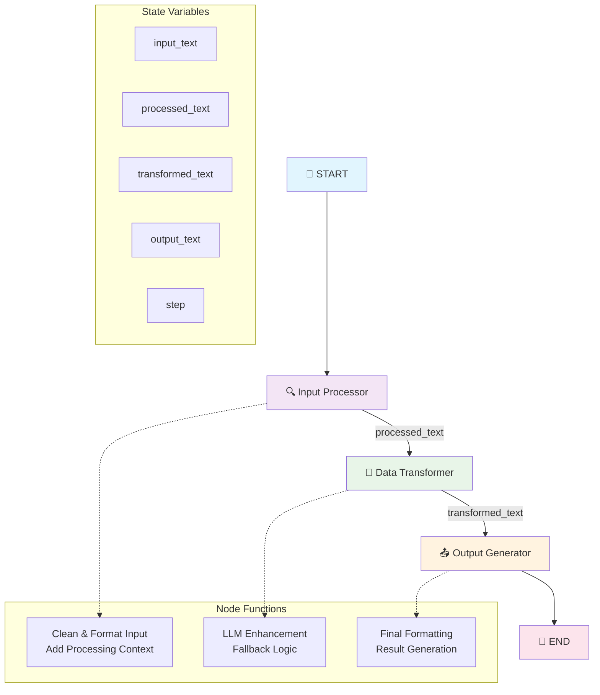
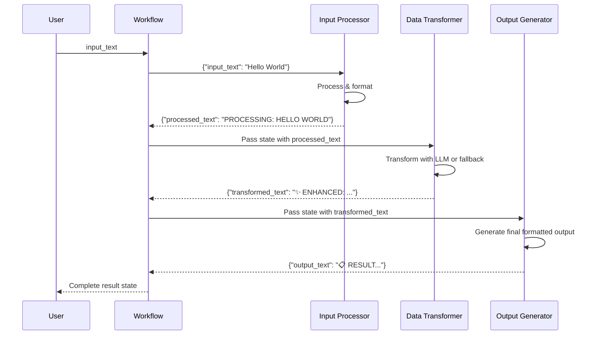
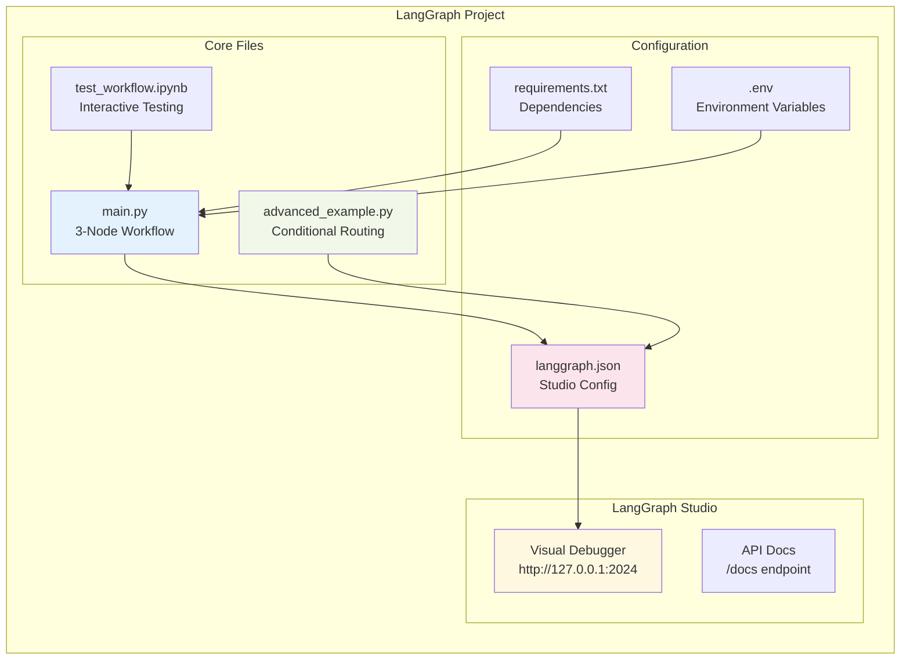
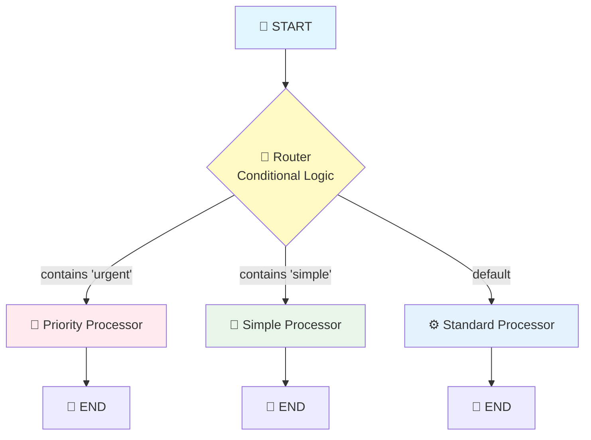
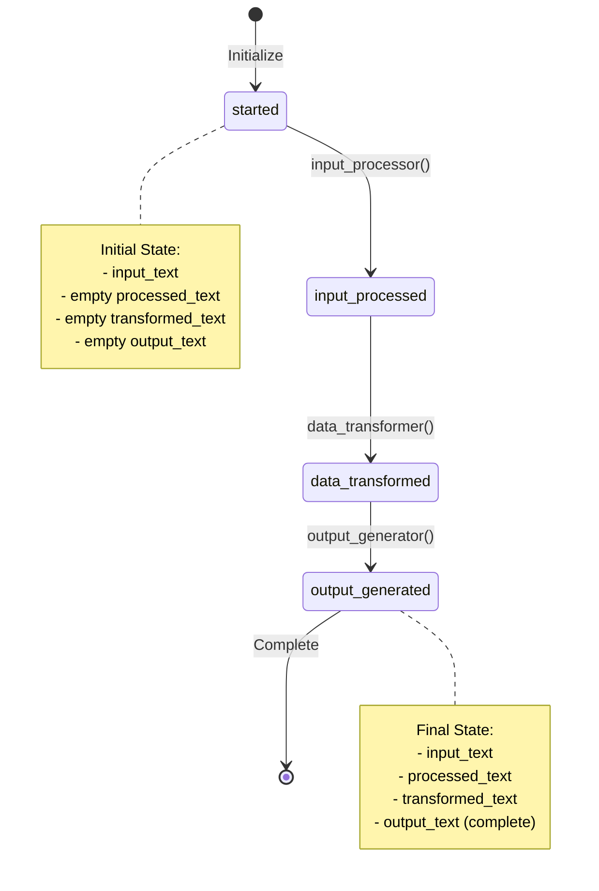

# LangGraph Workflow Diagrams

## 📊 Main Workflow Architecture

## 🔄 Data Flow Sequence

## 🏗️ Project Architecture

## 🎯 Advanced Workflow with Conditional Routing

## 📝 State Diagram

## 🔍 Node Details

### Input Processor Node
- **Input**: `input_text`
- **Process**: Clean, format, and add context
- **Output**: `processed_text`
- **Example**: "hello" → "PROCESSING: HELLO"

### Data Transformer Node
- **Input**: `processed_text`
- **Process**: LLM enhancement (with fallback)
- **Output**: `transformed_text`
- **Example**: "PROCESSING: HELLO" → "✨ TRANSFORMED: ENHANCED: HELLO ✨"

### Output Generator Node
- **Input**: `transformed_text`
- **Process**: Final formatting with metadata
- **Output**: `output_text`
- **Example**: Creates complete formatted result

## 🎨 Viewing These Diagrams

### In VS Code:
1. Install "Markdown Preview Mermaid Support" extension
2. Right-click this file → "Open Preview"
3. Diagrams will render beautifully

### In GitHub:
- GitHub natively renders Mermaid diagrams in Markdown files
- Just commit and push this file

### Online:
- Copy diagram code to https://mermaid.live
- Export as PNG/SVG for presentations

## 🚀 Quick Reference

**Workflow Path**: START → input_processor → data_transformer → output_generator → END

**State Flow**: input_text → processed_text → transformed_text → output_text

**Files**: main.py (basic) | advanced_example.py (routing) | test_workflow.ipynb (testing)
